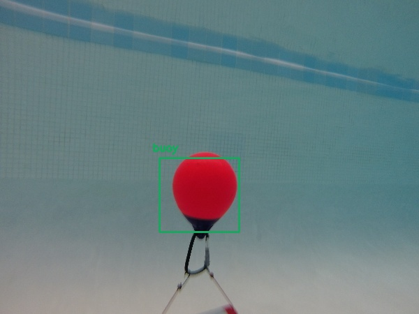
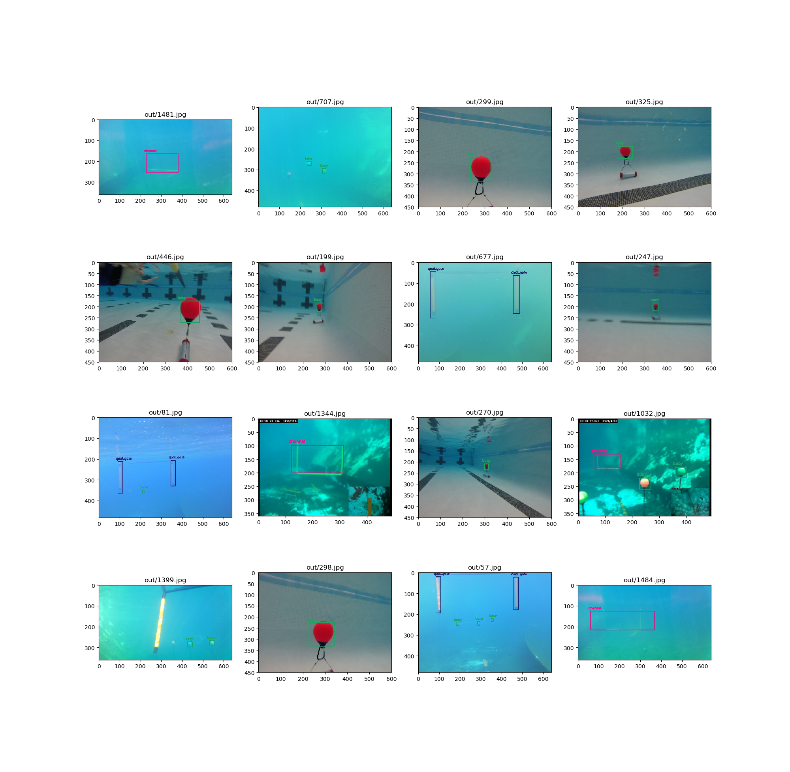

## Instructions on Training on AUV Underwater Dataset



#### Clone AlexeyAB Darknet Repo

`git clone https://github.com/AlexeyAB/darknet.git`

#### Build Darknet

Modify the makefile to change `GPU=0` to `GPU=1`

Note that this will compile darknet to be training with a GPU, which if you don't have will cause errors. Training on CPU is not efficient and probably not worth attempting, if you want to experiment with CPU training keep GPU=0

In case you get an error regarding nvcc execute 

Add your cuda installation directory in path. One way to do that is:

`export PATH=/usr/local/cuda-your_cuda_version/bin${PATH:+:${PATH}}`

To troubleshoot problems in this stage use 

```
nvidia-smi
```

You should see CUDA 10.0> and driver version 410>


#### Importing Images

Add files into the `data/images` folder

Must be .jpg with .txt file. Format and information can be found on AlexeyAB repostiroy. 

Execute `python generate_cfg.py`


#### Training 


Execute 

```
./train_darketnet.sh
```

When training on GPU you can get:

```
CUDA Error: out of memory
CUDA Error: out of memory: File exists
```

Modify the .cfg file subdivisions to an increased number e.g. 16

#### Testing 

Execute 

```
python yolo.py
```

For correct class labels modify `data/obj.names`


#### Results

```
python visualize.py
```


